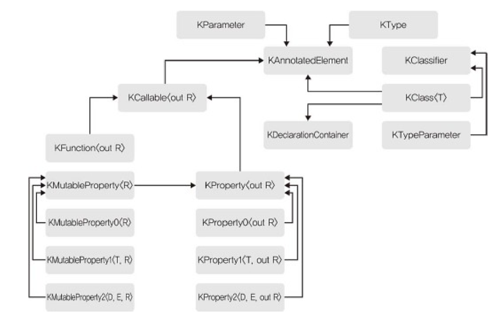

# 10장 애너테이션과 리플렉션

## 10.1 애너테이션

* 커스텀 메타데이터를 정의하고 메타데이터를 소스코드의 선언, 식, 파일 등의 요소에 엮는 방법을 제공하는 것
* 애너테이션은 런타임에 접근 가능하다.

### 10.1.1 애너테이션 클래스 정의하고 사용하기

* `@{이름}` 으로 애너테이션 사용 가능
* 애너테이션은 코틀린 식에도 사용 가능

```kotlin
val s = @Suppress("UNCHECKED_CAST") objects as List<String>
```

* 대괄호를 이용해 여러 애너테이션을 같은 구성요소에 붙일 수 있다.

```kotlin
@[Synchronized Strictfp] // @Synchronized @Strictfp와 같은 역할을 함
fun main() {
}
```

* 클래스의 주 생성자에 애너테이션을 붙이고 싶다면 주생성자에 constructor 키워드를 붙여야 한다.

---

* annotation class 키워드로 애너테이션 타입을 정의할 수 있다.
    * 애너테이션 클래스는 멤버, 부생성자, 초기화 코드가 없다.
    * 코틀린 1.3부터는 내포된 클래스, 인터페이스, 객체를 애너테이션 본문에 넣을 수 있다.
* 주 생성자 파라미터를 통해 커스텀 속성을 추가할 수 있다.
    * 주 생성자 파라미터는 반드시 val 로 선언해야 한다.
    * 파라미터에 디폴트값, 가변 인자를 사용할 수도 있다.
    * 애너테이션 타입으로 인스턴스를 만들수는 없다.
    * 애너테이션 타입의 파라미터는 다음과 같은 타입으로 제한된다.
        * 원시 타입
        * String
        * 이넘
        * 다른 애너테이션
        * 클래스 리터럴
        * 위 타입으로 이뤄진 배열
            * 배열은 대괄호를 통해 간결하게 생성해 전달할 수 있다.(`@Component(["AB", "CD"])`)
    * 파라미터는 널이 될 수 없다.
* 애너테이션 이름 앞에 : 을 붙여 적용 대상을 지정할 수 있다.

```kotlin
annotation class A

annotation class B

class Person1(@get:A val name: String)      // name의 Getter에 A 애너테이션 적용

class Person2(@get:[A B] val name: String)  // name의 Getter에 A, B 애너테이션 적용

class Person3(@get:A @field:B val name: String) // name의 Getter에 A, field에 B 애너테이션 적용
```

* `@file:{애너테이션}` 을 사용해 전체 파일에 애너테이션을 붙일 수도 있다.
    * 해당 선언은 파일의 가장 최상단에 위치해야 한다.

### 10.1.2 내장 애너테이션

#### @Retention

* 애너테이션이 저장되고 유지되는 방식 제어
    * **SOURCE**
        * 애너테이션은 컴파일 시점에만 존재하며 바이너리 출력에는 저장되지 않음
    * **BINARY**
        * 바이너리 출력에는 저장되지만 런타임에 리플렉션 API를 통해 관찰할 수는 없음
    * **RUNTIME**
        * 바이너리 출력에도 저장되고 리플렉션 API를 통해 관찰 가능
        * 코틀린 애너테이션 기본값
* 식에 붙는 애너테이션은 런타임까지 유지할 수 없어 SOURCE로 Retention을 지정해야한다.

```kotlin
//error: expression annotations with retention other than SOURCE are prohibited
@Target(AnnotationTarget.EXPRESSION)        // 식에 사용하는 애너테이션은 RUNTIME Retention 사용 불가능
annotation class Annotation

@Target(AnnotationTarget.EXPRESSION)
@Retention(AnnotationRetention.SOURCE)
annotation class Annotation2 // Ok
```

#### @Repeatable

* 같은 요소에 반복해서 적용할 수 있는 애너테이션을 의미함
* 반복할 수 있는 애너테이션은 런타임까지 유지할 수 없음
    * Retention을 SOURCE로 지정해야 함

#### @MustBeDocumented

* 애너테이션을 문서에 꼭 포함시키라는 뜻
* 애너테이션이 공개 API의 일부인 경우 해당 애너테이션 사용

#### @Target

* 애너테이션을 붙일 수 있는 요소를 지정한다.
* 가변 인자로 요소를 지정할 수 있다.
    * CLASS
        * 클래스, 인터페이스, 객체(애너테이션 클래스 포함)
    * ANNOTATION_CLASS
        * 애너테이션 클래스
    * TYPEALIAS
        * 타입 별명 정의
    * PROPERTY
        * 프로퍼티
    * FIELD
        * 프로퍼티를 뒷받침하는 필드
    * LOCAL_VARIABLE
        * 지역 변수(파라미터 제외)
    * VALUE_PARAMETER
        * 파라미터
    * CONSTRUCTOR
        * 주/부생성자
    * FUNCTION
        * 함수(생성자, 프로퍼티 접근자 제외)
    * PROPERTY_GETTER/PROPETRY_SETTER
        * 프로퍼티 접근자
    * FILE
        * 파일
    * TYPE
        * 타입 지정
    * EXPRESSION
        * 식

#### @Deprecated

* 사용 금지 예정이라는 의미
* @ReplaceWith 애너테이션을 파라미터로 넘겨 대안 제공 가능

```kotlin
@Deprecated(
    "Use readInt() instead", // 메시지
    ReplaceWith("readInt()") // 대안
)
fun readNum() = readLine()!!.toInt()

fun readInt(radix: Int = 10) = readLine()!!.toInt(radix)
```

* DeprecationLevel 이넘을 사용해 심각성도 지정할 수 있다.
    * WARNING
        * 사용 시 경고 표시
    * ERROR
        * 사용 시 컴파일 오류
    * HIDDEN
        * 접근하지 못하게 감춤

#### 기타 애너테이션

* @StrictFp
    * 부동소수점 연산의 정밀도 제한해 플랫폼간 이식성 높여줌
* @Synchronized
    * 애너테이션이 붙은 함수, 접근자에 진입 전 모니터 획득, 종료 후 모니터 해제
* @Volatile
    * 뒷받침하는 필드를 변경한 내용을 다른 스레드에서 즉시 관찰 가능하도록 해줌
* @Transient
    * 직렬화 매커니즘이 해당 애너테이션이 붙은 필드를 무시함
* @Supress
    * 컴파일러 경고 무시
    * 파일 전체에도 사용 가능

## 10.2 리플렉션

* 클래스, 함수, 프로퍼티의 런타임 표현에 접근할 수 있게 해주는 타입, 함수, 프로퍼티 모음

### 10.2.1 리플렉션 API 개요



* KAnnotatedElement
    * 모든 리플렉션 타입의 상위 타입
    * 구체적인 언어 요소에 정의된 애너테이션에 접근하는 기능 제공
    * 애너테이션 인스턴스로 이뤄진 리스트를 프로퍼티로 가짐

### 10.2.2 지정자와 타입

* 지정자는 타입을 정의하는 선언을 뜻한다.
* KClassifier 인터페이스에 의해 표현된다.
    * `KClass<T>`
        * 컴파일 시점에 T 타입인 클래스나 인터페이스, 객체 선언을 런타임에 표현
    * `KTypeParameter`
        * 제네릭 선언의 타입 파라미터를 표현
* 타입 별명을 표현하는 리플렉션 API는 현재 지원하지 않음

#### KClass\<T\>

* 클래스 리터럴을 사용해 인스턴스 얻을 수 있음

```kotlin
println(String::class)  // 클래스 리터럴 구문을 이용해 KClass 인스턴스 얻을 수 있음
```

* 확장 프로퍼티를 사용해 `java.lang.Class`를 변환할 수 있음

```kotlin
val stringClass = Class.forName("java.lang.String").kotlin  // 자바 클래스 인스턴스를 변환
println(stringClass)
println(String::class.java)     // KClass를 자바 Class 인스턴스로 변환도 가능
```

* KClass 인스턴스를 통해 어떤 변경자가 붙어있는지 알아낼 수 있다.
    * isAbstract, isCompanion 등...
* visibility 프로퍼티로 가시성 수준을 얻을 수 있다.
    * KVisibility 이넘을 반환한다.
    * 가시성을 표현할 수 없다면 null을 반환한다.
* simpleName, qualifiedName(패키지 포함 이름)을 통해 클래스 이름을 얻을 수 있다.
* jvmName은 자바 관점에서의 클래스 전체 이름을 반환한다.
* isInstance() 함수로 주어진 인스턴스의 타입을 체크할 수 있다.
* constructors, members, nestedClasses, typeParameters 프로퍼티를 이용해 멤버 선언에 접근할 수 있다.
* objectInstance를 이용해 객체 선언의 인스턴스를 얻을 수 있다.

#### KTypeParameter

* isReified()
    * 구체화된 타입 파라미터인지 여부 반환
* name
    * 타입 파라미터 이름
* upperBounds
    * 상위 바운드 타입으로 이뤄진 리스트 반환
    * 모든 코틀린 타입 파라미터는 Any?가 바운드로 있기에 빈 리스트는 반환되지 않음
* variance
    * 변성을 반환함
    * KVariance 이넘 값을 반환한다.

### 10.2.3 호출 가능

* 어떤 결과를 얻기 위해 호출할 수 있는 함수, 프로퍼티를 묶어주는 개념
* `KCallable<out R>` 인터페이스를 통해 표현한다.

#### KCallable

* 호출 가능 참조를 사용해 KCallable 인스턴스를 얻을 수 있음

```kotlin
fun combine(n: Int, s: String) = "$s$n"

fun main() {
    println(::combine.returnType) // kotlin.String
}
```

* KClass와 마찬가지로 변경자를 알아낼 수 있는 프로퍼티를 제공한다.
    * isAbstract, isFinal, visibility...
* 시그니처를 표현하는 프로퍼티가 속한 그룹을 제공함
    * name, typeParameters, parameters, returnType
* 호출 가능한 선언을 동적으로 호출할 수 있게 해주는 call 멤버 함수 제공
    * callBy를 통해 Map 형태로 인자를 넘길 수도 있음

```kotlin
fun call(vararg args: Any?): R
fun callBy(args: Map<KParameter, Any?>): R
```

#### 구체화된 호출 가능 요소 타입

* 모두 KCallable의 하위 타입이다.
* KProperty
    * 프로퍼티에 대한 변경자를 검사하는 프로퍼티 추가 제공
        * isConst, isLateinit
    * KProperty0, KProperty1, KProperty2 하위 타입 존재함
        * 수신객체가 없는 경우, 하나만 있는 경우(디스패치 혹은 확장), 두개인 경우(멤버인 확장)를 표현함
* KMutableProperty
    * KProperty에 세터가 추가된 타입
    * KMutableProperty도 수신 객체의 개수에 따라 세분화된 하위타입 존재함
* KFunction
    * 함수, 생성자 표현
    * 함수에 적용 가능한 변경자 검사를 위한 프로퍼티 포함함
