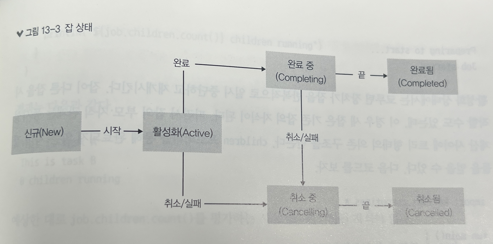

# 13장 동시성

## 13.1 코루틴

* 코틀린에서는 자바 동시성 요소를 사용하면 스레드 안전성 달성 가능
* 하지만 이런 동시성 연산은 블로킹 연산
* 블로킹 연산 이후 실행 재게 시 문맥 전환이 발생한다.
* 코루틴을 사용하면 명령형 스타일의 코드를 비동기 연산으로 처리할 수 있다.

### 13.1.1 코루틴과 일시 중단 함수

* 코루틴 라이브러리를 뒷받침하는 요소는 일시 중단 함수
* suspend 라는 키워드를 함수 앞에 붙여 선언할 수 있다.

```kotlin
suspend fun foo() {
    println("Task startde")
    delay(100)  // 코루틴 라이브러리의 일시 중단 함수
    println("Task finished")
}
```

* delay는 스레드 블럭 없이 호출한 함수를 일시 중단 시키고, 스레드가 다른 작업을 할 수 있게 해준다.
* 일시 중단 함수는 일시 중단, 일반 함수를 모두 호출할 수 있다.
    * 일시 중단 함수를 호출하면 해당 지점이 일시 중단 지점이 된다.
* 반대로 일반 함수가 일시 중단 함수를 호출하는 것은 금지된다.
* 일반 함수에서 일시 중단 함수를 사용하려면 코루틴 빌더를 사용해야 한다.

### 13.1.2 코루틴 빌더

#### launch

* launch 함수를 통해 코루틴을 시작하고, 작업의 상태를 추적하고 변경할 수 있는 Job 객체를 반환받을 수 있다.
    * launch 함수는 일시 중단 람다를 인자로 받는다.
    * 일시 중단 함수 내에서는 스레드 블럭 함수를 실행하는 것을 지양해야 한다.
* launch 함수는 결과를 만들어내지 않는 작업에 적합하다.

```kotlin
fun main() {
    GlobalScope.launch {
        delay(100)
        println("Task...")
    }
}
```

#### async

* 코루틴 작업이 결과를 만들어내야 할 경우 async를 사용한다.
    * async는 Deferred 인스턴스를 반환한다.
    * Deferred 인스턴스는 await 메서드를 통해 결과에 접근할 수 있다.
    * await 은 계산 결과나 취소가 될때까지 코루틴을 중단시킨다.

```kotlin
suspend fun main() {
    val message = GlobalScope.async {
        delay(100)
        "abc"
    }
    val result = message.await()
    println(result)
}
```

#### runBlocking

* launch, async는 백그라운드 스레드 풀에서 작업이 실행된다.
* runBlocking은 현재 실행중인 스레드에서 작업을 실행한다.
* 스레드가 블로킹되기 때문에 다른 코루틴에서 사용되면 안된다.
* 블로킹, 넌블로킹 호출 사이의 다리 역할을 하기 위해 고안된 코루틴 빌더

### 13.1.3 코루틴 영역과 구조적 동시성

* 코루틴 전역 영역(global scope)
    * 코루틴의 생명 주기가 애플리케이션 생명 주기에 의해서만 제약되는 영역
* 구조적 동시성(structured concurrency)
    * 코루틴을 다른 코루틴 안에서 실행할 경우 부모 자식 관계 성립
    * 자식의 생명 주기와 부모의 생명주기가 연관되는 것

```kotlin
fun main() {
    runBlocking {
        println("Start")
        launch {
            println("Task A Start")
            delay(100)
            println("Task A Finish")
        }

        launch {
            println("Task B Start")
            delay(100)
            println("Task B Finish")
        }
        println("Parent task Finish")
    }
    println("Shut Down")
}
```

* 부모 코루틴(runBlocking)의 실행이 먼저 끝나지만, 자식 코루틴(launch, Task A/B)의 실행이 끝날 때 까지 일시 중단 상태로 기다린다.

#### coroutineScope

* 커스텀 코루틴 영역을 선언할 수 있다.
* 자식 코루틴이 완료될 때까지 실행이 완료되지 않는다.
* coroutineScope는 일시 중단 상태로 스레드를 블럭시키지 않는다.

### 13.1.4 코루틴 문맥

* 코루틴마다 CoroutineContext 인터페이스 문맥이 연관되어 있다.
* coroutineContext 프로퍼티를 통해 문맥 접근 가능
    * 프로퍼티는 키-값 쌍으로 이뤄진 불변 컬렉션

```kotlin
GlobalScope.launch {
    println("Task is active: ${coroutineContext[Job.Key]!!.isActive}")
}
```

* 표준 코루틴 빌더에 의해 만들어지는 코루틴은 현재 문맥을 이어받는다.
* 빌더 함수에 context 파라미터로 새로운 문맥을 넘길 수도 있다.

```kotlin
import kotlin.coroutines.coroutineContext

private fun CoroutineScope.showName() {
    println("Current coroutine: ${coroutineContext[CoroutineName]?.name}")
}

fun main() {
    runBlocking {
        showName()      // Current coroutine: null
        launch(coroutineContext + CoroutineName("Worker")) {
            showName()      // Current coroutine: Worker
        }
    }
}
```

* 코루틴 실행 중 withContext를 통해 새 문맥, 일시 중단 람다를 넘겨 문맥 전환도 가능하다.
    * 특정 코드블록을 다른 스레드에서 실행시킬 때 유용하다.

## 13.2 코루틴 흐름 제어와 잡 생명 주기

* 잡
    * 동시성 작업의 생명 주기를 표현하는 객체
    * 작업 상태를 추적하고, 작업을 취소할 수 있다.
    * CoroutineStart 타입의 인자를 사용해 잡의 초기 상태를 선택할 수 있다.
        * CoroutineStart.DEFAULT
            * 즉시 잡 시작
        * CoroutineStart.LAZY
            * 잡이 신규 상태가 되고 시작(start, join)을 기다림
            * 잡이 다른 잡을 시작할 경우, 시작된 잡은 기존 잡의 자식이 된다.
            * children 프로퍼티로 완료되지 않은 자식 잡을 얻을 수 있다.



* isActive, isCompleted, isCancelled 프로퍼티를 통해 현재 잡의 상태를 추적할 수 있다.ㅣ

### 13.2.1 취소

* cancel 메서드를 통해 잡을 취소할 수 있다.
* 잡을 취소하면 취소가 되었는지 검사해야 한다.
    * isActive를 활용해서 취소 상태를 검사하거나, CancellationException을 발생시켜 취소에 반응할 수 있는 일시 중단 함수를 호출하는 방법이 있다.
        * delay, join, yield 등이 취소에 반응할 수 있는 일시 중단 함수이다.

### 13.2.2 타임아웃

* withTimeout 함수를 통해 타임아웃이 존재하는 코루틴을 선언할 수 있다.
* 지정한 타임아웃이 지나면 TimeoutCancellationException 예외가 발생한다.
* withTimeoutOrNull 을 통해 타임아웃 발생 시 예외 대신 널을 반환할 수도 있다.

### 13.2.3 코루틴 디스패치하기

* 코루틴을 사용하려면 실행중인 스레드와 무관하게 계산을 실행할 수는 있지만, 실행중인 스레드와 결국 연관은 필요하다.
* 코루틴 디스패처를 사용하면 코루틴 실행 시 사용할 스레드를 제어하는 작업을 할 수 있다.

```kotlin
fun main() {
    runBlocking {
        launch(Dispatchers.Default) {   // 전역 스레드풀 디스패처 사용
            println(Thread.currentThread().name)
        }
    }
}
```

* 코루틴 디스패처는 자바 실행기(Executor)와 비슷하다.
    * asCoroutineDispatcher() 확장 함수를 이용하면 실행기를 디스패처로 쉽게 변경할 수 있다.
    * 해당 확장 함수를 통해 얻은 dispatcher는 use 함수 블록 안에서 사용하거나, 사용 후 close() 메서드를 호출해주어야 한다.

#### 기본 Dispatcher

* Dispatchers.Default
    * 전역 공유 스레드 풀
* Dispatchers.IO
    * 블로킹 작업을 많이 처리하는 작업을 실행하는데 최적화되어 있는 스레드풀
    * Default와 스레드 풀을 공유하지만, 필요에 따라 스레드가 추가, 종료될 수 있다.
* Dispatchers.Main
    * UI 스레드에서만 배타적으로 작동하는 디스패처

### 13.2.4 예외 처리

* 코루틴 빌더는 예외를 부모 코루틴에 전달하거나, await을 통해 예외를 전달 받는 방법을 선택할 수 있다.

#### 예외 전달

* 자식 코루틴에서 발생한 예외는 부모로 전달되며, 전역 영역으로 도달할 때까지 전파된다.
* CoroutineExceptionHandler 를 통해 예외 핸들러 로직을 추가할 수 있다.
* CoroutineExceptionHandler 는 전역 영역의 코루틴에서만 정의할 수 있다.
    * CoroutineExceptionHandler는 정의된 코루틴의 자식에 대해서만 적용된다.

#### 예외 저장 후, await에서 처리

* async 빌더에서 사용할 수 있다.
* await을 호출할 경우, 발생한 예외가 던져진다.
* 자식 코루틴에서 발생한 예외를 await을 통해 처리할 때 try-catch를 사용해도 결국 부모 코루틴을 취소시키기 위해 예외는 전파된다.
    * 슈퍼바이저 잡을 사용해 이런 동작을 방지할 수 있다.

#### 슈퍼바이저 잡

* 슈퍼바이저 잡에서는 취소는 아래 방향으로만 전달된다.
* 슈퍼바이저가 취소되면 자식은 모두 취소된다.
* 슈퍼바이저의 자식이 취소될 경우, 슈퍼바이저나 다른 자식들은 영향을 받지 않는다.
* supervisorScope() 함수를 사용해 슈퍼바이저 잡 영역을 지정할 수 있다.

## 13.3 동시성 통신

### 13.3.1 채널

* 코루틴 사이에 데이터 스트림을 공유할 수 있는 편리한 방법
* send, receive 메서드를 제공한다.
    * 채널의 버퍼가 꽉 찬 상황에서 데이터를 보낼 경우, 코루틴은 일시 중단되고 처리가 가능해질 때 재개된다.
        * 블로킹되지 않는다.

```kotlin
fun main() {
    runBlocking {
        val streamSize = 5
        val channel = Channel<Int>(3)

        launch {
            for (n in 1..streamSize) {
                delay(Random.nextLong(100))
                val square = n * n
                println("Sending: $square")
                channel.send(square)
            }
        }

        launch {
            for (i in 1..streamSize) {
                delay(Random.nextLong(100))
                val n = channel.receive()
                println("Receiving: $n")
            }
        }
    }
}
```

#### 채널 관련 상수

* Channel.UNLIMITED
    * 채널의 용량이 제한이 없으며, 버퍼는 필요에 따라 증가한다.
    * send가 호출될때 중단될 일이 없다.
    * 버퍼가 비어있으면 receive는 중단될 수 있다.
* Channel.RENDEZVOUS
    * 버퍼가 없는 채널이 된다.
    * send는 receive가 호출될 때까지 일시 중단된다.
    * receive도 send가 호출될 때까지 일시 중단된다.
* Channel.CONFLATED
    * 송신된 값이 덮어씌워지는 채널
    * 최대 하나의 값만 버퍼에 저장된다.
    * 버퍼에 저장된 값이 있는 상태에서 send를 호출할 경우 기존 값을 덮어씌운다.
    * send가 호출될때 중단될 일이 없다.

### 13.3.2 생산자

* produce 코루틴 빌더를 통해 데이터 스트림을 생성할 수 있다.
* send 메서드를 제공하는 ProducerScope 영역을 제공한다.

```kotlin
fun main() {
    runBlocking {
        val channel = produce {
            for (n in 1..5) {
                val square = n * n
                println("Sending: $square")
                send(square)
            }
        }

        launch {
            channel.consumeEach { println("Receiving: $it") }
        }
    }
}
```

* 코루틴이 종료되면 자동으로 채널은 닫힌다.
* produce는 async, await 예외처리 정책을 따른다.

### 13.3.3 티커

* Unit 값을 지연시간마다 계속해서 발생시키는 특별한 랑데부 채널
* 신호를 받아 특정 동작을 수행하는 구현에서 사용할 수 있다.
* 실험 단계의 API 이다.

### 13.3.4 액터

* 가변 상태를 스레드 안전하게 공유하는 방법
* actor() 코루틴 빌더를 통해 액터를 만들 수 있다.
    * ActorScope가 만들어진다.

```kotlin
sealed class AccountMessage

class GetBalance(
        val amount: CompletableDeferred<Long>
) : AccountMessage()

class Deposit(val amount: Long) : AccountMessage()

class Withdraw(
        val amount: Long,
        val isPermitted: CompletableDeferred<Boolean>
) : AccountMessage()

fun CoroutineScope.accountManager(
        initialBalance: Long
) = actor<AccountMessage> {
    var balance = initialBalance

    for (message in channel) {
        when (message) {
            is GetBalance -> message.amount.complete(balance)

            is Deposit -> {
                balance += message.amount
                println("Deposited ${message.amount}")
            }

            is Withdraw -> {
                val canWithdraw = balance >= message.amount
                if (canWithdraw) {
                    balance -= message.amount
                    println("Withdrawn ${message.amount}")
                }
                message.isPermitted.complete(canWithdraw)
            }
        }
    }
}

private suspend fun SendChannel<AccountMessage>.deposit(
        name: String,
        amount: Long
) {
    send(Deposit(amount))
    println("$name: deposit $amount")
}

private suspend fun SendChannel<AccountMessage>.tryWithdraw(
        name: String,
        amount: Long
) {
    val status = CompletableDeferred<Boolean>().let {
        send(Withdraw(amount, it))
        if (it.await()) "OK" else "DENIED"
    }
    println("$name: withdraw $amount ($status)")
}

private suspend fun SendChannel<AccountMessage>.printBalance(
        name: String
) {
    val balance = CompletableDeferred<Long>().let {
        send(GetBalance(it))
        it.await()
    }
    println("$name: balance is $balance")
}

fun main() {
    runBlocking {
        val manager = accountManager(100)
        withContext(Dispatchers.Default) {
            launch {
                manager.deposit("Client #1", 50)
                manager.printBalance("Client #1")
            }

            launch {
                manager.tryWithdraw("Client #2", 100)
                manager.printBalance("Client #2")
            }
        }

        manager.tryWithdraw("Client #0", 1000)
        manager.printBalance("Client #0")
        manager.close()
    }
}
```

* actor 빌더는 데이터를 받기 위해 채널을 사용한다.
    * CoroutineScope.accountManager 가 채널의 메시지를 소비하는 액터가 된다.
        * 메시지의 종류에 따라 각 동작을 수행한다.
    * 액터는 CompletableDeferred의 complete를 호출해 메시지를 보낸 클라이언트에게 결과 값을 돌려줄 수 있다.
* 액터 API도 실험 단계이다.

## 13.4 자바 동시성 사용하기

### 13.4.1 스레드 시작하기

* Runnable에 대응하는 람다와 스레드 프로퍼티를 이용해 thread() 함수를 사용하면 스레드를 시작할 수 있다.
* timer()를 사용하면 지정한 시간 간격으로 실행되는 동작을 정의할 수 있다.

### 13.4.2 동기화와 락

* synchronized 함수를 사용해 동기화 구문을 지정할 수 있다.
* @Synchronized 애너테이션을 사용하면 메서드 레벨의 동기화 구문을 지정할 수 있다.
* withLock() 함수를 사용하면 자바의 Lock 객체를 사용해 람다를 실행할 수 있다.
    * 해당 람다 종료 시 자동으로 락이 해제된다.
